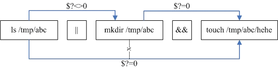
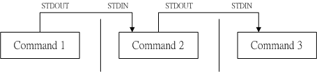

# 1. 认识bash

Bash是一种特殊的shell, 所谓shell,是用户使用命令行与系统进行沟通的系统沟通的介质。有了图形界面，为什还要用shell? 

- 大家都一样。不同发行版本的图形界面操作大不相同，单时shell命令都一样。
- 速度快。大多服务器版都没有提供图形界面。原因就是图形界面浪费资源。
- 学习shell,还可以自己编写shell脚本，更自如的管理系统。

shell依据发展者的不同有很多不同的版本，比如：sh(Bourne SHell)、C SHELL、K SHELL、TCSH。当然还有linux使用的版本 Bash (Bourne Again SHell)。

我们可以查看 /etc/shells文件，来了解我们系统可以使用的shell。

```
$ cat /etc/shells
# /etc/shells: valid login shells
/bin/sh
/bin/dash
/bin/bash
/bin/rbash
```

虽然各家的shell都差不多，但是语法表达上还是有所不同。我们重点来学习linux下常用的bash。

 **特性**

1. 命令记忆。可以通过上下箭头键查找历史命令，这些命令记录在用户主目录的.bash_history档案中。
2. 命令补全。可以按tab键来补全命令。
3. 别名设置。通过alias命令来设置命令的别名，如：`alias lm='ls -al'` 以后，当你执行lm时，就相当与执行了 `ls-al`命令
4. 程序化脚本。
5. 支持万用符。如执行`ls -l ~/X*`将列出家目录下所有以X开头的文件或X开头的目录下的所有文件。

**技巧**

* 命令换行输入。默认的按下enter建是执行命令，要实现换行要借助脱逃字符\,在\后紧跟enter，则为换行。
* `Ctrl+u  `从光标处向前删除命令；`ctrl+u`光标处向后删除命令；`ctrl+a`光标移动到最前；`ctrl+e`光标移动到左后。

# 2. 变量功能

常见的变量分为 **普通变量**、**环境变量**以及**接口变量**三种。普通变量的作用域是当前程序；环境变量的作用域是整个系统，在任何程序中都能访问。环境变量又分**系统环境变量**和**自定义环境**变量，为了区分，系统环境变量通常大写。

### 变量的取用、设置与销毁

- 变量的取用。使用\$变量名或者 \${变量名}来取得变量的值。比如要PATH变量的值可用 `echo  $PATH` 来实现。

- 变量的设置：

  1. 在命令行或脚本中手动赋值：

      * 变量与变量的值以=号来链接，如`myvar=测试`.注意变量明前没有$；
      * =两边不能有空格;
      * 变量值中如果有空格，需要使用单引号或双引号隔开括起来。双引号内可以用$
      * 读取变量的值，单引号内则不能;可以用反单引号\`指令\`或\$(指令)，将指令的执行结果，复制给变量。如` version="你的系统版本为：$(uname -r)"` ;
      * export来将变量声明为环境变量，这样就可以在其他程序中引用该变量。

  2. 使用 read接收键盘的输入，为变量赋值。

     ```
     [dmtsai@study ~]$ read [-pt] variable
     选项与参数:
     -p :后面可以接提示字符!
     -t :后面可以接等待的“秒数!”这个比较有趣~不会一直等待使用者啦!
     范例一:让使用者由键盘输入一内容,将该内容变成名为 atest 的变量
     [dmtsai@study ~]$ read atest
     This is a test
     &lt;==此时光标会等待你输入!请输入左侧文字看看
     [dmtsai@study ~]$ echo ${atest}
     This is a test
     &lt;==你刚刚输入的数据已经变成一个变量内容!
     范例二:提示使用者 30 秒内输入自己的大名,将该输入字串作为名为 named 的变量内容
     [dmtsai@study ~]$ read -p "Please keyin your name: " -t 30 named
     Please keyin your name: VBird Tsai
     &lt;==注意看,会有提示字符喔!
     [dmtsai@study ~]$ echo ${named}
     VBird Tsai
     &lt;==输入的数据又变成一个变量的内容了!
     ```

- 变量类型

   三种类型：字符串，数字和数组  

  变量的默认类型为字符型，如下运算：

  ```
  zhangle@zhangle-computer:~$ sum=1+2+3
  zhangle@zhangle-computer:~$ echo $sum
  1+2+3
  ```

  要想进行数字运算，则必须要把变量宣告为数字，需要借助 declare或typset命令。

  ```
  $ declare [-aixr] variable
  选项与参数:
  -a :将后面名为 variable 的变量定义成为阵列 (array) 类型
  -i :将后面名为 variable 的变量定义成为整数数字 (integer) 类型
  -x :用法与 export 一样,就是将后面的 variable 变成环境变量;
  -r :将变量设置成为 readonly 类型,该变量不可被更改内容,也不能 unset
  ```

  将上面代码改为：

  ```
  zhangle@zhangle-computer:~$ declare -i sum=1+2+3
  zhangle@zhangle-computer:~$ echo $sum
  6
  ```

  **数组** 

  定义：var[index]=value；例如：

  ```
  zhangle@zhangle-computer:$ var[1]="small min"
  zhangle@zhangle-computer:$ var[2]="big min"
  zhangle@zhangle-computer:$ var[3]="nice min"
  zhangle@zhangle-computer:$ echo "${var[1]}, ${var[2]}, ${var[3]}"
  small min, big min, nice min
  ```

  ​

- 变量的销毁。使用unset 变量名，如`unset myvar`;

### 环境变量

常见的系统环境变量

* PATH bash会按该变量记录的路径顺序来搜寻指令。
* HOME  记录了当前登录用户家目录的位置。
* SHELL 当前shell程序的位置
* LANG 当前的语系
* RANDOM 随机数，我们可以使用$RANDOM来取得一个随机数。

可以使用`env`观察环境变量；可以使用`locale`来查看语系变量，这些语系变量决定了系统所用的语系，在/etc/locale.conf文件中为这些变量赋予初始值。

### 接口变量

* **PS1** 命令提示符变量。可以通过该变量的值来设置命令提示符的样式。我当前的命令提示符是这样子的`zhangle@zhangle-computer:~$`,看一下PS!的值：

  ```
  zhangle@zhangle-computer:~$ echo $PS1
  \[\e]0;\u@\h: \w\a\]${debian_chroot:+($debian_chroot)}\u@\h:\w\$
  ```

  PS1变量值中符号的意义如下：

  \d :可显示出“星期 月 日”的日期格式,如:"Mon Feb 2"
  \H :完整的主机名称。举例来说,鸟哥的练习机为“study.centos.vbird”
  \h :仅取主机名称在第一个小数点之前的名字,如鸟哥主机则为“study”后面省略
  \t :显示时间,为 24 小时格式的“HH:MM:SS”
  \T :显示时间,为 12 小时格式的“HH:MM:SS”
  \A :显示时间,为 24 小时格式的“HH:MM”
  \@ :显示时间,为 12 小时格式的“am/pm”样式
  \u :目前使用者的帐号名称,如“dmtsai”;
  \v :BASH 的版本信息,如鸟哥的测试主机版本为 4.2.46(1)-release,仅取“4.2”显示
  \w :完整的工作目录名称,由根目录写起的目录名称。但主文件夹会以 ~ 取代;
  \W :利用 basename 函数取得工作目录名称,所以仅会列出最后一个目录名。

  \#:下达的第几个指令。

  \$ :提示字符,如果是 root 时,提示字符为 # ,否则就是 $ 啰~

* **\$** 当前shell的PID。\$本身也是一个变量，可以通过`echo $$` 来查看当前shell的PID。

* **?** 变量存放者执行的上个指令的回传值。

* **OSTYPE, HOSTTYPE, MACHTYPE**:(主机硬件与核心的等级)

可以使用`set`来观察所有的变量。

### 变量内容的操作

删除或替换变量值中符合条件的内容：

| 设置方式                                     | 说明                                       |
| :--------------------------------------- | ---------------------------------------- |
| \${var#条件}<br>${var##条件}                 | 删除var变量开头和条件匹配的值的值。条件支持万用符(*)。<br>类似php中ltrim()的功能.<br> 一个#号表示最短匹配，两个#号表示最长匹配。 |
| \${var%条件}<br>${var%%条件}                 | 删除var变量结尾和条件匹配的值的值。条件支持万用符(*)。<br>类似php中rtrim()的功能.<br> 一个%号表示最短匹配，两%号表示最长匹配。 |
| \${var/old_str/new_str}<br>${var//old_str/new_str} | 用新字符串替换老字符串。一个/表示替换从左起第一个old_str.两个表示替换全部。 |

例子：

```
zhangle@zhangle-computer:~$ test=123:456:123:456
zhangle@zhangle-computer:~$ echo ${test#1*:}
456:123:456
zhangle@zhangle-computer:~$ echo ${test##1*:}
456
zhangle@zhangle-computer:~$ echo ${test%:*}
123:456:123
zhangle@zhangle-computer:~$ echo ${test%%:*}
123
zhangle@zhangle-computer:~$ echo ${test/123/789}
789:456:123:456
zhangle@zhangle-computer:~$ echo ${test//123/789}
789:456:789:456

```


**变量空值检测**

有时候需要根据变量的赋值情况，来决定做一些操作，可以用到下面的方法：

下表中，var和str是变量，expr是常量或命令

| 变量的设置方式          | str没有设置           | str为空字符串          | str非空字符串        |
| ---------------- | ----------------- | ----------------- | --------------- |
| var=${str-expr}  | var=exp           | var=空字符串          | var=$str        |
| var=${str:-expr} | var=expr          | var=expr          | var=$str        |
| var=${str+expr}  | var=              | var=expr          | var=expr        |
| var=${str:+expr} | var=              | var=              | var=expr        |
| var=${str=expr}  | str=expr var=expr | str 不变 var=       | str 不变 var=$str |
| var=${str:=expr} | str=expr var=expr | str=expr var=expr | str 不变 var=$str |
| var=${str?expr}  | expr 输出至 stderr   | var=              | var=$str        |
| var=${str:?expr} | expr 输出至 stderr   | expr 输出至 stderr   | var=$str        |

```
zhangle@zhangle-computer:~$ echo ${sex-男}
男
zhangle@zhangle-computer:~$ ${sex-head -n 1 /etc/passwd}
root:x:0:0:root:/root:/bin/bash
```

透过上面例子，大家举一反三。

# 3.Bash Shell的操作环境

### 3.1 路径与指令搜索顺序

1. 以相对/绝对路径执行指令,例如“ /bin/ls ”或“ ./ls ”;
2. 由 alias 找到该指令来执行;
3. 由 bash 内置的 (builtin) 指令来执行;
4. 通过 $PATH 这个变量的顺序搜寻到的第一个指令来执行。

### 3.2 bash 的进站画面与欢迎讯息

* 进站画面。在终端机接口 (tty1 ~tty6) 登陆的时候,会有几行提示的字串吗?那就是进站画面。它的内容在在/etc/issue文件里面。在文件中可以用一些特定代码来输出特殊的信息。issue 内的各代码意义如下：

  | 代码   | 意义                                |
  | ---- | --------------------------------- |
  | \d   | 本地端时间的日期;                         |
  | \l   | 显示第几个终端机接口;                       |
  | \m   | 显示硬件的等级 (i386/i486/i586/i686...); |
  | \n   | 显示主机的网络名称;                        |
  | \O   | 显示 domain name;                   |
  | \r   | 操作系统的版本 (相当于 uname -r)            |
  | \t   | 显示本地端时间的时间;                       |
  | \S   | 操作系统的名称;                          |
  | \v   | 操作系统的版本。                          |

  当我们使用 telnet 连接到主机时,主机的登陆画面就会显示/etc/issue.net 而不是 /etc/issue 。

* 欢迎信息。果您想要让使用者登陆后取得一些信息, 那么可以讯息加入 /etc/motd 里面去!

### 3.3 Bash的环境配置文件

bash 在启动时会读取配置文件。配置文件又可以分为全体系统的配置文件以及使用者个人偏好配置文件。我们前几个小节谈到的命令别名、自订的变量,在你登出 bash 后就会失效,所以你想要保留你的设置, 就得要将这些设置写入配置文件才行。

* **login shell 读取的配置文件**

  取得 bash 时需要完整的登陆流程的,就称为 login shell。举例来说,你要由 ~ tty6 登陆,需要输入使用者的帐号与密码,此时取得的 bash 就称为“ login shell“。

  在取得login shell时，系统会读取如下配置文件：

  1. /etc/profile(login shell 才会读): 

     这是系统整体的设置,你最好不要修改这个文件; 在这个文件中，这只了系统常用的环境变量，还会去调用外部的设置数据。 在 CentOS 7.x 默认的下,下面这些数据会依序的被调用进来:

     /etc/profile.d/*.sh、/etc/locale.conf、 /usr/share/bash-completion/completions/\*

  2. ~/.bash_profile 或 ~/.bash_login 或 ~/.profile:  属于使用者个人设置,你要改自己的数据,就写入这里!

     在读取完系统的配置文件后，就会以我们列出的顺序则读取个人配置文件，只要读到一个，就会忽略后面的。在~/.bash_profile文中又会读入~/bashrc的内容，而在~/.bashrc中进而又读取了/etc/bashrc文件中的内容。

因为上述配置文件实在取得login shell时才会被读取，因此，如果你对上述配置文件中的内容做了修改，需要登出再登入才能起作用。不过你也可以使用source命令来手动读取配置文件使其生效。如`$ source ~/.profile`。

* **non-login shell 读取的配置文件**

  所谓non-login shell ,就是取得 bash 接口的方法不需要登陆的举动,举例来说:

  (1)你以 X window 登陆 Linux 后, 再以 X 的图形化接口启动终端机,此时那个终端接口并没有需要再次的输入帐号与密码,那个 bash 的环境就称为 non-login shell。

  (2)你在原本的 bash 环境下再次下达 bash 这个指令,同样的也没有输入帐号密码, 那第二个 bash(子程序) 也是 non-login shell 。

  在取得non-login shell时，系统仅仅读取~/.bashrc这个配置文件。

* **其他的配置文件**

  * /etc/man_db.conf : 这个文件规定了下达 man 的时候,该去哪里查看数据的路径设置!
  * ~/.bash_history: 我们的历史命令就记录在这里.
  * ~/.bash_logout: 这个文件则记录了“当我登出 bash 后,系统再帮我做完什么动作后才离开”。

### 3.4 终端机的环境设置: stty, set

我们在终端，使用 [ctrl]+c 来强制终止一个指令的运行,当输入错误时,就会有声音跑出来警告。这是怎么
办到的呢? 这是因为登陆终端机的时候,会自动的取得一些终端机的输入环境的设置。

我们可以利用 `stty -a`命令 来列出目前环境中所有的按键列表,在上头的列表当中,需要注意的是特殊字体那几个, 此外,如果出现 ^ 表示 [Ctrl] 那个按键的意思。举例来说, intr = ^C 表示利用 [ctrl] + c 来达成的。

几个重要的代表意义是:

* quit : 送出一个 quit 的讯号给目前正在 run 的程序;
* erase : 向后删除字符,
* kill : 删除在目前命令行上的所有文字;
* eof : End of file 的意思,代表“结束输入”。
* start : 在某个程序停止后,重新启动他的 output
* stop : 停止目前屏幕的输出;
* 10.4 Bash Shell 的操作环境:
* 532鸟哥的 Linux 私房菜:基础学习篇 第四版
* susp : 送出一个 terminal stop 的讯号给正在 run 的程序。

bash 默认的组合键汇整如下:

| 组合件      | 执行结果                  |
| -------- | --------------------- |
| Ctrl + C | 终止目前的命令               |
| Ctrl + D | 输入结束 (EOF),例如邮件结束的时候; |
| Ctrl + M | 就是 Enter 啦!           |
| Ctrl + S | 暂停屏幕的输出               |
| Ctrl + Q | 恢复屏幕的输出               |
| Ctrl + U | 在提示字符下,将整列命令删除        |
| Ctrl + Z | “暂停”目前的命令             |

### 3.5 万用字符与特殊符号

常用的万用字符:

| 符号   | 意义                                       |
| ---- | ---------------------------------------- |
| *    | 代表“ 0 个到无穷多个”任意字符                        |
| ?    | 代表“一定有一个”任意字符                            |
| [ ]  | 同样代表“一定有一个在括号内”的字符(非任意字符)。例如 [abcd] 代表“一定有一 |
| [-]  | 若有减号在中括号内时,代表“在编码顺序内的所有字符”。例如 [0-9] 代表 0 到 9 之<br>间的所有数字,因为数字的语系编码是连续的! |
| \[^] | 若中括号内的第一个字符为指数符号 (^) ,那表示“反向选择”,例如 \[^abc] 代表一定有一个字符,只要是非 a, b, c 的其他字符就接受的意思。 |

特殊符号:

| 符号     | 内容                                     |
| ------ | -------------------------------------- |
| #      | 注解符号:这个最常被使用在 script 当中,视为说明!在后的数据均不执行 |
| \      | 跳脱符号:将“特殊字符或万用字符”还原成一般字                |
| 竖杠     | 管线 (pipe):分隔两个管线命令的界定(后两节介绍);          |
| ;      | 连续指令下达分隔符号:连续性命令的界定 (注意!与管线命令并不相同)     |
| ~      | 使用者的主文件夹                               |
| $      | 取用变量前置字符:亦即是变量之前需要加的变量取代值              |
| &      | 工作控制 (job control):将指令变成背景下工作          |
| !      | 逻辑运算意义上的“非” not 的意思!                   |
| /      | 目录符号:路径分隔的符号                           |
| \>, >> | 数据流重导向:输出导向,分别是“取代”与“累加”               |
| <, <<  | 数据流重导向:输入导向 (这两个留待下节介绍                 |
| ' '    | 单引号,不具有变量置换的功能 ($ 变为纯文本)               |
| " "    | 具有变量置换的功能! ($ 可保留相关功能)                 |
| ``     | 两个“ ` ”中间为可以先执行的指令,亦可使用 $( )           |
| ( )    | 在中间为子 shell 的起始与结束                     |
| { }    | 在中间为命令区块的组合!                           |

# 4 数据流重导向

在shell中执行一个程序的时候，需要面对三个问题：

1. 如果该命令需要用户输入一些数据，用户该怎么来输入
2. 怎样将命令的处理结果告知给用户
3. 如过发生错误该怎么告诉用户

shell默认的解决方案是：

1. 如果需要输入数据，竟让他用键盘来输入。即所谓的标准输入 standard input(简称:STDIN)
2. 把处理结果直接输出在命令终端。即所谓的标准输出。standard output(简称:STDOUT)
3. 把执行过程中遇到的错误也输出在命令终端。即所谓的标准错误输出. standard error(简称:STDERR)。

不管是输入的数据、输出的结果、错误信息统称为数据流，所谓数据流重导向，就是将原本输出在屏幕上的命令执行结果，输出到文件、设备中或垃圾桶黑洞（/dev/null)中。原本需要使用键盘进行输入的数据改用其他文件的内容来代替。主要通过以下符号实现：

* **\> 或 >>** STDOUT 重导向符号

  将标准输出 standard output （简称：STDOUT）输出到文件或设备。什么是标准输出呢？命令的执行结果分为两类，一时正确的结果，二是错误信息。我们将正确的结果称之为 标准输出，将错误的结果称之为标准错误输出 standard error (简称：STDEE)。

  具体的用法：命令 > 文件或设备。>和>>的区别是，前者是以重新的方式写入文件，后者为追加的方式。

* **2>或2>>**  STDERR 重导向符号

  这两个符号和标准输出一直，只是是用来重导向标准错误输出的。

* **<**  STDIN重导向符号

  < 后面紧跟一个文件，将原本需要键盘输入的内容，改由 < 符号后面的文件内容提供。

  ​

**例子**

当你以一般身份执行 find 这个指令的时候,由于权限的问题可能会产生一些信息。

```
zhangle@zhangle-computer:~$ find /home -name .bashrc
find: ‘/home/lost+found’: 权限不够
/home/zhangle/.bashrc
find: ‘/home/zhangle/.gvfs’: 权限不够

#将stdout重导向到文件，你会看到到屏幕上输出了STDEE。
zhangle@zhangle-computer:~$ find /home -name .bashrc >~/test.log 
find: ‘/home/lost+found’: 权限不够  
find: ‘/home/zhangle/.gvfs’: 权限不够
zhangle@zhangle-computer:~$ cat ~/test.log
/home/zhangle/.bashrc

#将STDOUT和STDEE都重导向到文件中，屏幕上看不到任何输出
zhangle@zhangle-computer:~$ find /home -name .bashrc >~/test.log 2>~/test_error.log
zhangle@zhangle-computer:~$ cat ~/test_error.log
find: ‘/home/lost+found’: 权限不够
find: ‘/home/zhangle/.gvfs’: 权限不够

#将STDOUT和STDEE都输出到一个文件中
zhangle@zhangle-computer:~$ find /home -name .bashrc >~/test.log 2>&1  #正确写法
zhangle@zhangle-computer:~$ cat ~/test.log
find: ‘/home/lost+found’: 权限不够
/home/zhangle/.bashrc
find: ‘/home/zhangle/.gvfs’: 权限不够

zhangle@zhangle-computer:~$ find /home -name .bashrc >~/test.log 2>~/test.log  #错误写法，这样写，test.log的结果可能回乱。


#标准输入的重导向
[zhangle: test]$ read -p "请输入你的姓名:" name
请输入你的姓名:zhangle   
[zhangle: test]$ echo $name  
zhangle
[zhangle: test]$ cat > name.text
wangwu
[zhangle: test]$ read -p "请输入你的姓名:" name < name.text
[zhangle: test]$ echo $name
wangwu
```
还有一个符号**<<** ，它用来定义键盘输入时的结束符。比如用cat > file 来新建一个文件时，我们输入文件内容完毕后需要按ctrl+d来结束输入。我们还可以这样：`cat > file << eof`来定义一个结束符，当内容输入完毕后，输入一个eof，来结束输入。这对于编写shell script很重要。


**命令执行的判断依据**

- cmd;cmd 考虑相关性的连续指令下达。

- $? (指令回传值) 与 && 或 ||

  在同时下达多个指令时，由前一个命令的执行回传值来决定后面的命令是否要执行。

  系统把命令的回传值存放在变量?中， \$? == 0 ，表示命令执行成功，否则失败，失败时\$通常为错误码。

  | 指令下达的情况       | 说明                                |
  | ------------- | --------------------------------- |
  | cmd1 && cmd2  | 若cmd1执行完毕后，$?==0,则cmd2执行，反之不执行。   |
  | cm1 \|\| cmd2 | cm1 执行完毕后，$? <>  0 ,则cm2执行，反之不执行。 |

  例子:

  ```
  [zhangle:~]$ ls /tmp/abc || mkdir /tmp/abc && touch /tmp/abc/test
  ls: 无法访问'/tmp/abc': 没有那个文件或目录
  [zhangle@~]$ ls /tmp/abc
  test
  ```

  以上命令的执行执行过程分析：

  


# 5. 管线命令

如果一个命令的STDOUT，要经过几个命令的连续处理，才是我们想要的结果，该如何实现呢？这就要借助管线命令，其使用了"|"这个界定符。示意图如下：



管线命令仅能处理来自前一个命令的STDOUT,忽略STDERR。如果你硬要让 STDERR 可以被管线命令所使用,通过上一小节的数据流重导向即可!  具体做法：让 2>&1 加入指令中~就可以让 2> 变成 1> ；

|后面要紧跟一个能够接受STDOUT的命令。常见的命令如下：

**摘取命令**

* **cut** 将同一行中的数据使用制定的符号进行切割，以取得所需要的数据。

  ```
  [dmtsai@study ~]$ cut -d'分隔字符' -f fields  <==用于有特定分隔字符
  [dmtsai@study ~]$ cut -c 字符区间             <==用于排列整齐的讯息
  选项与参数:
  -d :后面接分隔字符。与 -f 一起使用;
  -f :依据 -d 的分隔字符将一段讯息分区成为数段,用 -f 取出第几段的意思;
  -c :以字符 (characters) 的单位取出固定字符区间;

  示例，截取PATH中的第一个第五个字段。
  [zhangle: ~]$ echo ${PATH}
  /home/zhangle/工具/android-studio/bin:/usr/lib/jvm/java-8-openjdk-amd64/bin:/usr/local/sbin:/usr/local/bin:/usr/sbin:/usr/bin:/sbin:/bin:/usr/games:/usr/local/games:/snap/bin
  [zhangle: ~]$ echo ${PATH}|cut -d ':' -f 3,5
  /usr/local/sbin:/usr/sbin
  范例二:将 export 输出的讯息,取得第 12 字符以后的所有字串
  [zhangle: ~]$ export
  declare -x HISTCONTROL="ignoredups"
  declare -x HISTSIZE="1000"
  declare -x HOME="/home/dmtsai"
  declare -x HOSTNAME="study.centos.vbird"
  .....(其他省略).....
  #注意看,每个数据都是排列整齐的输出!如果我们不想要“ declare -x ”时,就得这么做:
  [zhangle: ~]$ export | cut -c 12-
  HISTCONTROL="ignoredups"
  HISTSIZE="1000"
  HOME="/home/dmtsai"
  HOSTNAME="study.centos.vbird"
  .....(其他省略).....
  # 知道怎么回事了吧?用 -c 可以处理比较具有格式的输出数据!
  # 我们还可以指定某个范围的值,例如第 12-20 的字符,就是 cut -c 12-20 等等!
  ```


* **grep** 以行为单位，将含有我们想要信息的行摘取出来。

  ```
  [dmtsai@study ~]$ grep [-acinv] [--color=auto] '搜寻字串' filename
  选项与参数:
  -a :将 binary 文件以 text 文件的方式搜寻数据
  -c :计算找到 '搜寻字串' 的次数
  -i :忽略大小写的不同,所以大小写视为相同
  -n :顺便输出行号
  -v :反向选择,亦即显示出没有 '搜寻字串' 内容的那一行!
  --color=auto :可以将找到的关键字部分加上颜色的显示喔!
  范例一:将 last 当中,有出现 root 的那一行就取出来;
  [dmtsai@study ~]$ last | grep 'root'
  范例二:与范例一相反,只要没有 root 的就取出!
  [dmtsai@study ~]$ last | grep -v 'root'
  范例三:在 last 的输出讯息中,只要有 root 就取出,并且仅取第一栏
  [dmtsai@study ~]$ last | grep 'root' | cut -d ' ' -f1
  # 在取出 root 之后,利用上个指令 cut 的处理,就能够仅取得第一栏啰!
  范例四:取出 /etc/man_db.conf 内含 MANPATH 的那几行
  [dmtsai@study ~]$ grep --color=auto 'MANPATH' /etc/man_db.conf
  ....(前面省略)....
  MANPATH_MAP
  /usr/games
  /usr/share/man
  MANPATH_MAP
  /opt/bin
  /opt/man
  MANPATH_MAP
  /opt/sbin
  /opt/man
  # 加上 --color=auto 的选项,找到的关键字部分会用特殊颜色显示喔!
  ```

**排序命令**

* **sort**

  以数字或文本的类型来排序。

  ```
  [dmtsai@study ~]$ sort [-fbMnrtuk] [file or stdin]
  选项与参数:
  -f :忽略大小写的差异,例如 A 与 a 视为编码相同;
  -b :忽略最前面的空白字符部分;
  -M :以月份的名字来排序,例如 JAN, DEC 等等的排序方法;
  -n :使用“纯数字”进行排序(默认是以文字体态来排序的);
  -r :反向排序;
  -u :就是 uniq ,相同的数据中,仅出现一行代表;
  -t :分隔符号,默认是用 [tab] 键来分隔;
  -k :以那个区间 (field) 来进行排序的意思
  范例一:个人帐号都记录在 /etc/passwd 下,请将帐号进行排序。
  [dmtsai@study ~]$ cat /etc/passwd | sort
  abrt:x:173:173::/etc/abrt:/sbin/nologin
  adm:x:3:4:adm:/var/adm:/sbin/nologin
  alex:x:1001:1002::/home/alex:/bin/bash
  # 鸟哥省略很多的输出~由上面的数据看起来, sort 是默认“以第一个”数据来排序,
  # 而且默认是以“文字”型态来排序的喔!所以由 a 开始排到最后啰!
  范例二:/etc/passwd 内容是以 : 来分隔的,我想以第三栏来排序,该如何?
  [dmtsai@study ~]$ sort -t ':' -k 3 < /etc/passwd
  root:x:0:0:root:/root:/bin/bash
  dmtsai:x:1000:1000:dmtsai:/home/dmtsai:/bin/bash
  alex:x:1001:1002::/home/alex:/bin/bash
  arod:x:1002:1003::/home/arod:/bin/bash
  # 看到特殊字体的输出部分了吧?怎么会这样排列啊?呵呵!没错啦~
  # 如果是以文字体态来排序的话,原本就会是这样,想要使用数字排序:
  # cat /etc/passwd &#124; sort -t ':' -k 3 -n
  # 这样才行啊!用那个 -n 来告知 sort 以数字来排序啊!
  范例三:利用 last ,将输出的数据仅取帐号,并加以排序
  [dmtsai@study ~]$ last | cut -d ' ' -f1 | sort
  ```


* **uniq**

  以行为单位去重复

  ```
  [dmtsai@study ~]$ uniq [-ic]
  选项与参数:
  -i :忽略大小写字符的不同;
  -c :进行计数
  范例一:使用 last 将帐号列出,仅取出帐号栏,进行排序后仅取出一位;
  [dmtsai@study ~]$ last | cut -d ' ' -f1 | sort | uniq
  范例二:承上题,如果我还想要知道每个人的登陆总次数呢?
  [dmtsai@study ~]$ last | cut -d ' ' -f1 | sort | uniq -c
  1
  6 (unknown
  47 dmtsai
  4 reboot
  7 root
  1 wtmp
  # 从上面的结果可以发现 reboot 有 4 次, root 登陆则有 7 次!大部分是以 dmtsai 来操作!
  # wtmp 与第一行的空白都是 last 的默认字符,那两个可以忽略的!
  ```


- **wc** 统计文件中的行数，单词数，字符数

  ```
  [dmtsai@study ~]$ wc [-lwm]
  选项与参数:
  -l :仅列出行;
  -w :仅列出多少字(英文单字);
  -m :多少字符;
  范例一:那个 /etc/man_db.conf 里面到底有多少相关字、行、字符数?
  [dmtsai@study ~]$ cat /etc/man_db.conf &#124; wc
  131
  723
  5171
  # 输出的三个数字中,分别代表: “行、字数、字符数”
  范例二:我知道使用 last 可以输出登陆者,但是 last 最后两行并非帐号内容,那么请问,
  我该如何以一行指令串取得登陆系统的总人次?
  [dmtsai@study ~]$ last | grep [a-zA-Z] | grep -v 'wtmp' | grep -v 'reboot' | \
  | grep -v 'unknown' | wc -l
  # 由于 last 会输出空白行, wtmp, unknown, reboot 等无关帐号登陆的信息,因此,我利用
  # grep 取出非空白行,以及去除上述关键字那几行,再计算行数,就能够了解啰!
  ```

  ​

**双向重导向**

* **tee**  会同时将数据流分送到文件去与屏幕 (screen)

  ```
  [dmtsai@study ~]$ tee [-a] file
  选项与参数:
  -a :以累加 (append) 的方式,将数据加入 file 当中!
  [dmtsai@study ~]$ last | tee last.list | cut -d " " -f1
  # 这个范例可以让我们将 last 的输出存一份到 last.list 文件中;
  [dmtsai@study ~]$ ls -l /home | tee ~/homefile | more
  # 这个范例则是将 ls 的数据存一份到 ~/homefile ,同时屏幕也有输出讯息!
  [dmtsai@study ~]$ ls -l / | tee -a ~/homefile | more
  # 要注意! tee 后接的文件会被覆盖,若加上 -a 这个选项则能将讯息累加
  ```

**字符转换命令**

* **tr ** 删除或替换一段信息中的文字。该命令支持正则表达式.

  ```
  [dmtsai@study ~]$ tr [-ds] SET1 ...
  选项与参数:
  -d :删除讯息当中的 SET1 这个字串;
  -s :取代掉重复的字符!
  范例一:将 last 输出的讯息中,所有的小写变成大写字符:
  [dmtsai@study ~]$ last | tr '[a-z]' '[A-Z]'
  # 事实上,没有加上单引号也是可以执行的,如:“ last &#124; tr [a-z] [A-Z] ”
  范例二:将 /etc/passwd 输出的讯息中,将冒号 (:) 删除
  [dmtsai@study ~]$ cat /etc/passwd | tr -d ':'
  范例三:将 /etc/passwd 转存成 dos 断行到 /root/passwd 中,再将 ^M 符号删除
  [dmtsai@study ~]$ cp /etc/passwd ~/passwd && unix2dos ~/passwd
  [dmtsai@study ~]$ file /etc/passwd ~/passwd
  /etc/passwd:
  ASCII text
  /home/dmtsai/passwd: ASCII text, with CRLF line terminators &lt;==就是 DOS 断行
  [dmtsai@study ~]$ cat ~/passwd | tr -d '\r' > ~/passwd.linux
  # 那个 \r 指的是 DOS 的断行字符,关于更多的字符,请参考 man tr
  [dmtsai@study ~]$ ll /etc/passwd ~/passwd*
  -rw-r--r--. 1 root
  root
  2092 Jun 17 00:20 /etc/passwd
  -rw-r--r--. 1 dmtsai dmtsai 2133 Jul 9 22:13 /home/dmtsai/passwd
  -rw-rw-r--. 1 dmtsai dmtsai 2092 Jul 9 22:13 /home/dmtsai/passwd.linux
  # 处理过后,发现文件大小与原本的 /etc/passwd 就一致了!
  ```

  ​

* **col** 常用来将tab建替换成空白字符。

* **join** 将两个文件以行为单位，按照指定的分割符分割，对比指定字段的数据是否相同，如果相同，对比的字段作为新行的首个字段，将第一个文件当前行中去除对比字段的其他字段放在其后，再在后面放上第二个文件中当前行祛除对比字段的其他字段，字段间以分割符分割，然后输出。

  ```
  dmtsai@study ~]$ join [-ti12] file1 file2
  选项与参数:
  -t :join 默认以空白字符分隔数据,并且比对“第一个字段”的数据,
  如果两个文件相同,则将两笔数据联成一行,且第一个字段放在第一个!
  -i :忽略大小写的差异;
  -1 :这个是数字的 1 ,代表“第一个文件要用那个字段来分析”的意思;
  -2 :代表“第二个文件要用那个字段来分析”的意思。
  范例一:用 root 的身份,将 /etc/passwd 与 /etc/shadow 相关数据整合成一栏
  [root@study ~]# head -n 3 /etc/passwd /etc/shadow
  ==> /etc/passwd <==
  root:x:0:0:root:/root:/bin/bash
  bin:x:1:1:bin:/bin:/sbin/nologin
  daemon:x:2:2:daemon:/sbin:/sbin/nologin
  ==> /etc/shadow <==
  root:$6$wtbCCce/PxMeE5wm$KE2IfSJr...:16559:0:99999:7:::
  bin:*:16372:0:99999:7:::
  daemon:*:16372:0:99999:7:::
  # 由输出的数据可以发现这两个文件的最左边字段都是相同帐号!且以 : 分隔
  [root@study ~]# join -t ':' /etc/passwd /etc/shadow | head -n 3
  root:x:0:0:root:/root:/bin/bash:$6$wtbCCce/PxMeE5wm$KE2IfSJr...:16559:0:99999:7:::
  bin:x:1:1:bin:/bin:/sbin/nologin:*:16372:0:99999:7:::
  daemon:x:2:2:daemon:/sbin:/sbin/nologin:*:16372:0:99999:7:::
  # 通过上面这个动作,我们可以将两个文件第一字段相同者整合成一列!
  # 第二个文件的相同字段并不会显示(因为已经在最左边的字段出现了啊!)
  范例二:我们知道 /etc/passwd 第四个字段是 GID ,那个 GID 记录在
  /etc/group 当中的第三个字段,请问如何将两个文件整合?
  [root@study ~]# head -n 3 /etc/passwd /etc/group
  ==> /etc/passwd <==
  root:x:0:0:root:/root:/bin/bash
  bin:x:1:1:bin:/bin:/sbin/nologin
  daemon:x:2:2:daemon:/sbin:/sbin/nologin
  ==> /etc/group <==
  root:x:0:
  bin:x:1:
  daemon:x:2:
  # 从上面可以看到,确实有相同的部分喔!赶紧来整合一下!
  [root@study ~]# join -t ':' -1 4 /etc/passwd -2 3 /etc/group | head -n 3
  0:root:x:0:root:/root:/bin/bash:root:x:
  1:bin:x:1:bin:/bin:/sbin/nologin:bin:x:
  2:daemon:x:2:daemon:/sbin:/sbin/nologin:daemon:x:
  # 同样的,相同的字段部分被移动到最前面了!所以第二个文件的内容就没再显示。
  # 请读者们配合上述显示两个文件的实际内容来比对!
  ```

* **paste**  将两个文件按行合并，中间以制定的分割符分割。

  ```
  [dmtsai@study ~]$ paste [-d] file1 file2
  选项与参数:
  -d :后面可以接分隔字符。默认是以 [tab] 来分隔的!
  -:如果 file 部分写成 - ,表示来自 standard input 的数据的意思。
  ```

* **expand** 将[tab]键转换为空白键。

**文件分割命令**

* **split** 依据大小或行数将一个文件分割成数个文件。

  ```
  [dmtsai@study ~]$ split [-bl] file PREFIX
  选项与参数:
  -b :后面可接欲分区成的文件大小,可加单位,例如 b, k, m 等;
  -l :以行数来进行分区。
  PREFIX :代表前置字符的意思,可作为分区文件的前导文字。
  范例一:我的 /etc/services 有六百多K,若想要分成 300K 一个文件时?
  [dmtsai@study ~]$ cd /tmp; split -b 300k /etc/services services
  [dmtsai@study tmp]$ ll -k services*
  -rw-rw-r--. 1 dmtsai dmtsai 307200 Jul 9 22:52 servicesaa
  -rw-rw-r--. 1 dmtsai dmtsai 307200 Jul 9 22:52 servicesab
  -rw-rw-r--. 1 dmtsai dmtsai 55893 Jul 9 22:52 servicesac
  # 那个文件名可以随意取的啦!我们只要写上前导文字,小文件就会以
  # xxxaa, xxxab, xxxac 等方式来创建小文件的!
  范例二:如何将上面的三个小文件合成一个文件,文件名为 servicesback
  [dmtsai@study tmp]$ cat services* &gt;&gt; servicesback
  # 很简单吧?就用数据流重导向就好啦!简单!
  范例三:使用 ls -al / 输出的信息中,每十行记录成一个文件
  [dmtsai@study tmp]$ ls -al / &#124; split -l 10 - lsroot
  [dmtsai@study tmp]$ wc -l lsroot*
  10 lsrootaa
  10 lsrootab
  4 lsrootac
  24 total
  # 重点在那个 - 啦!一般来说,如果需要 stdout/stdin 时,但偏偏又没有文件,
  # 有的只是 - 时,那么那个 - 就会被当成 stdin 或 stdout ~
  ```

**参数替代**

* **xargs** 将STDIN以行为单位 ,以空白字符或断行字符进行分割，并作为参数传递给其后紧跟的命令。如果没有跟命令，默认为echo.

  ```
  [dmtsai@study ~]$ xargs [-0epn] command
  选项与参数:
  -0 :如果输入的 stdin 含有特殊字符,例如 `, \, 空白键等等字符时,这个 -0 参数
  可以将他还原成一般字符。这个参数可以用于特殊状态喔!
  -e :这个是 EOF (end of file) 的意思。后面可以接一个字串,当 xargs 分析到这个字串时,
  就会停止继续工作!
  -p :在执行每个指令的 argument 时,都会询问使用者的意思;
  -n :后面接次数,每次 command 指令执行时,要使用几个参数的意思。
  当 xargs 后面没有接任何的指令时,默认是以 echo 来进行输出喔!

  范例一:将 /etc/passwd 内的第一栏取出,仅取三行,使用 id 这个指令将每个帐号内容秀出来
  [dmtsai@study ~]$ id root
  uid=0(root) gid=0(root) groups=0(root)
  # 这个 id 指令可以查询使用者的 UID/GID 等信息
  [dmtsai@study ~]$ id $(cut -d ':' -f 1 /etc/passwd | head -n 3)
  # 虽然使用 $(cmd) 可以预先取得参数,但可惜的是, id 这个指令“仅”能接受一个参数而已!
  # 所以上述的这个指令执行会出现错误!根本不会显示用户的 ID 啊!
  [dmtsai@study ~]$ cut -d ':' -f 1 /etc/passwd | head -n 3 | id
  uid=1000(dmtsai) gid=1000(dmtsai) groups=1000(dmtsai),10(wheel)
  # 我不是要查自己啊!
  # 因为 id 并不是管线命令,因此在上面这个指令执行后,前面的东西通通不见!只会执行 id!
  [dmtsai@study ~]$ cut -d ':' -f 1 /etc/passwd | head -n 3 | xargs id
  # 依旧会出现错误!这是因为 xargs 一口气将全部的数据通通丢给 id 处理~但 id 就接受 1 个啊最多!
  [dmtsai@study ~]$ cut -d ':' -f 1 /etc/passwd | head -n 3 | xargs -n 1 id
  uid=0(root) gid=0(root) groups=0(root)
  uid=1(bin) gid=1(bin) groups=1(bin)
  uid=2(daemon) gid=2(daemon) groups=2(daemon)
  # 通过 -n 来处理,一次给予一个参数,因此上述的结果就 OK 正常的显示啰!
   
  范例二:同上,但是每次执行 id 时,都要询问使用者是否动作?
  [dmtsai@study ~]$ cut -d ':' -f 1 /etc/passwd | head -n 3 | xargs -p -n 1 id
  id root ?...y
  uid=0(root) gid=0(root) groups=0(root)
  id bin ?...y
  .....(下面省略).....
  # 呵呵!这个 -p 的选项可以让使用者的使用过程中,被询问到每个指令是否执行!

  范例三:将所有的 /etc/passwd 内的帐号都以 id 查阅,但查到 sync 就结束指令串
  [dmtsai@study ~]$ cut -d ':' -f 1 /etc/passwd | xargs -e'sync' -n 1 id
  # 仔细与上面的案例做比较。也同时注意,那个 -e'sync' 是连在一起的,中间没有空白键。
  # 上个例子当中,第六个参数是 sync 啊,那么我们下达 -e'sync' 后,则分析到 sync 这个字串时,
  # 后面的其他 stdin 的内容就会被 xargs 舍弃掉了!
  ```

  ​

**关于减号 - 的用途**

​	管线命令在 bash 的连续的处理程序中是相当重要的!另外,在 log file 的分析当中也是相当的一环, 所以请特别留意!另外,在管线命令当中,常常会使用到前一个指令的 stdout这次的 stdin , 某些指令需要用到文件名称 (例如 tar) 来进行处理时,该 stdin 与 可以利用减号 "-" 来替代, 举例来说:

  ```
[root@study ~]# mkdir /tmp/homeback
[root@study ~]# tar -cvf - /home | tar -xvf - -C /tmp/homeback
  ```


上面这个例子是说:“我将 /home 里面的文件给他打包,但打包的数据不是纪录到文件,而是
传送到 stdout; 经过管线后,将 tar -cvf - /home 传送给后面的 tar -xvf - ”。后面的这个 - 则是取用前一个指令的 stdout, 因此,我们就不需要使用 filename 了!这是很常见的例子喔!注意注意!